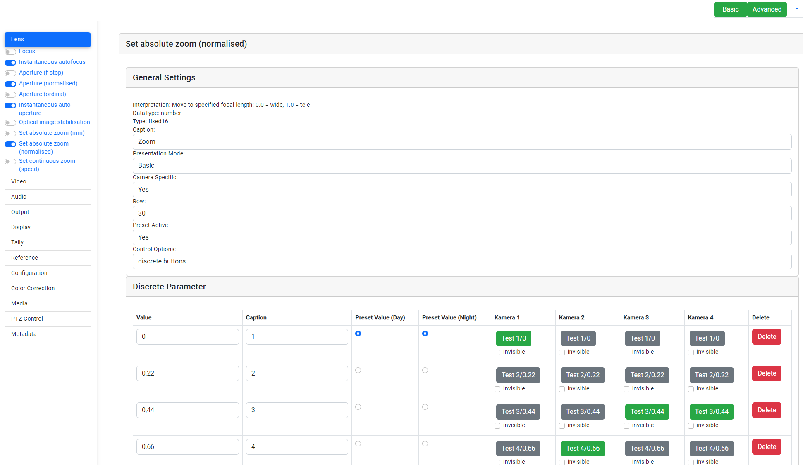

# Blackmagic Camera Controller

This software allows you to control Blackmagic cameras using an Arduino Uno with the Blackmagic SDK board, a Fujitsu Futro S920 ThinClient, and a custom Angular frontend. It has been tested with Blackmagic Studio Cameras.

## Table of Contents
- [Prerequisites](#prerequisites)
- [Hardware Setup](#hardware-setup)
- [Installation](#installation)
- [Usage](#usage)
- [Contributing](#contributing)
- [License](#license)

## Prerequisites
- Blackmagic camera(s) with support for SDI control
- Arduino Uno or compatible board
- Blackmagic SDK board
- Fujitsu Futro S920 ThinClient with 8GB DDR3 RAM and 128GB SSD
- Ubuntu MATE operating system installed on the ThinClient

## Hardware Setup
1. Mount the Blackmagic SDK board on the Arduino Uno.
2. Connect the Arduino Uno to the Fujitsu Futro S920 ThinClient using a USB cable.
3. Follow the hardware connections in the provided image: 

## Installation
1. Clone the repository: `git clone https://github.com/SvenSommer/BlackmagicCameraController.git`
2. Set up and configure each component:
    - **Arduino Sketch**: Upload the sketch from `sketches/Commandparser/Commandparser.ino` to the Arduino Uno.
    - **Backend**: Run the backend by executing `python main.py` in the `backend` directory. Configure the cameras and tally listener in their respective `config.yaml` files.
    - **Tally Listener**: Run the tally listener by executing `python main.py` in the `tallylistener` directory. Configure the vMix and backend settings in the `config.yaml` file.
    - **Frontend**: Navigate to the `frontend` directory, and update the `backendBaseUrl` in `src/app/environments/environment.ts` to point to the backend URL. Then, run `ng start`.

## Usage
1. Access the Angular frontend using a web browser.
2. Use the "config mode" to structure the available commands supported by the Blackmagic SDK. 
3. Toggle the commands you want to see in the "command mode". 
4. Define specific inputs (e.g., buttons with customizable captions and specific values) to trigger special commands for a specific or all cameras.

## Contributing
Contributions are welcome! Please feel free to submit pull requests or open issues to discuss potential improvements or report bugs.

## License
This project is licensed under the [MIT License](LICENSE).